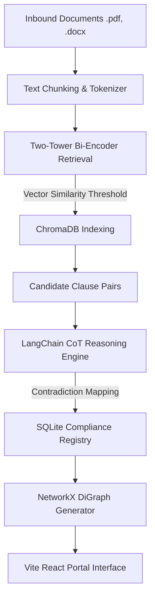

# ClauseGuard: Enterprise Edge Inconsistency Mapping Platform

[](https://fastapi.tiangolo.com/)
[](https://reactjs.org/)
[](https://www.trychroma.com/)
[](https://tailwindcss.com/)

**ClauseGuard** is an edge-native compliance mapping platform designed to automatically ingest, isolate, and identify critical contradictions and overlaps between master contract templates and incoming vendor agreements. Running entirely on local, offline-resilient edge hardware, it uses semantic sentence embeddings and localized Chain-of-Thought (CoT) reasoning models to prevent legal exposure without risking data leaks.

---

## 🏗️ Architecture & Core Pipeline



---

## ✨ Key Features

- **Isolated Ingestion Sessions**: Run separate document audit jobs under unique session identifiers. Clear database mappings and vector points dynamically with cascading SQLite deletions.
- **AI-Generated Clause Summarization**: Ingestion worker leverages local LLM reasoning to summarize long legal paragraphs into 10-15 word minimal descriptions by default, keeping review workflows clutter-free.
- **Collapsible Review Workspace**: Toggle between concise AI summaries and full raw legal paragraphs in a side-by-side review interface.
- **Targeted Knowledge Graphs**: Interactive contradiction graph visualizations mapped with custom layouts. Includes a **Focus Selected Only** filter that fades out unrelated paths to eliminate visual spiderwebs.
- **Markdown Report Dispatcher**: Compile a detailed compliance conflict report and simulate sharing with higher officials via Webhooks, Slack, Teams, or secure email channels.
- **Hardware Telemetry Monitor**: Displays RPi5/Laptop active memory, CPU load, and inference TPS metrics, featuring auto-fallbacks to smaller quantized models in resource-constrained environments.

---

## 🛠️ Technology Stack

- **Backend**: FastAPI (Python 3.10), SQLAlchemy ORM, SQLite DB, ChromaDB vector store, NetworkX (Graph Theory).
- **Frontend**: React 18, Vite, Tailwind CSS, React Flow (interactive node canvas), Lucide Icons.
- **Edge Inference**: LangChain, Ollama/Llama.cpp local model gateway (`llama3.1:8b-q4` & `qwen2.5:3b`).

---

## 🚀 Quick Start Guide

### 1. Prerequisite Model Setup (Optional for Demo)
If running local inference:
```bash
# Start your local Ollama server
ollama run llama3.1:8b-q4
```
*Note: If local inference is down, ClauseGuard automatically falls back to simulated offline models for continuous UI validation.*

### 2. Start the Backend API Gateway
From the repository root:
```bash
# Navigate to main folder and install dependencies
pip install -r requirements.txt

# Run FastAPI Server on localhost:8000
python -m uvicorn backend.main:app --reload
```

### 3. Start the Vite Frontend Server
From the repository root:
```bash
# Navigate to frontend folder
cd clauseguard/frontend

# Install dependencies
npm install

# Start local server
npm run dev
```
Open [http://localhost:5173](http://localhost:5173) in your web browser.

---

## 🧪 Testing and Verification

To execute the suite of backend database, graph builder, and retrieval tests:
```bash
cd clauseguard
pytest
```

To compile the frontend distribution build:
```bash
cd clauseguard/frontend
npm run build
```

---

## 📜 License
Distributed under the Enterprise MIT License. See `LICENSE` for details.
