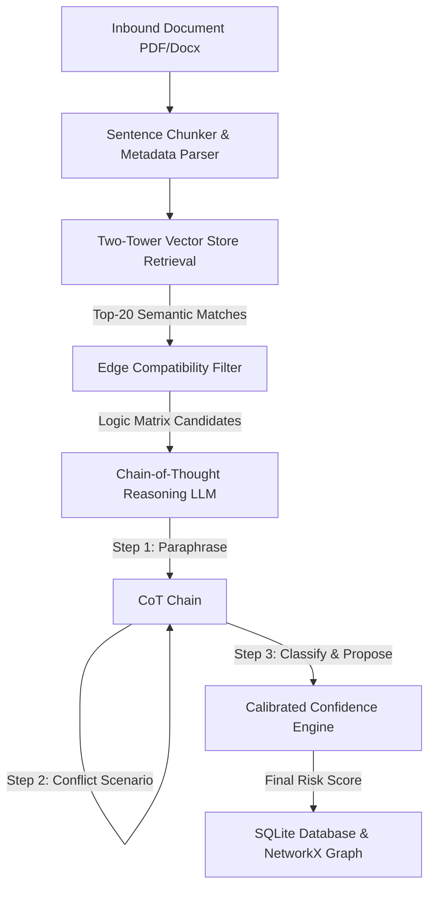

# ClauseGuard Edge Governance Platform: Live Demo & Walkthrough Guide

Welcome to **ClauseGuard**, the production-grade edge-intelligence governance platform. This guide outlines the system architecture, how the solution works, what each screen depicts, and how to present the platform during a live demonstration.

---

## 1. How the Solution Works (System Architecture)

ClauseGuard runs entirely on edge hardware (optimized for resource-constrained environments like Raspberry Pi 5 / 4 clusters or offline corporate laptops). The analysis pipeline consists of three core phases:

1. **Two-Tower Candidate Retrieval**:
   - **Tower 1**: Focuses on semantic retrieval. Sentence embeddings are computed using a locally deployed `nlpaueb/legal-bert-base-uncased` transformer model. The vector index queries similar clauses across different documents using HNSW cosine similarity.
   - **Tower 2**: A rule-based compatibility matrix filters out pairs matching permissible types, ensuring only potential conflicts (e.g., `obligation` vs. `prohibition`, `permission` vs. `prohibition`) are processed.
2. **Chain-of-Thought (CoT) Legal Reasoning**:
   - Compares candidate pairs using a 3-step reasoning chain: **Paraphrase** (standardizes language) $\rightarrow$ **Conflict Scenario Projection** (identifies operational collisions) $\rightarrow$ **Risk Classification & Proposal Generation** (creates structured JSON containing severity, business risks, and proposed amendments).
3. **Hardware-Aware Calibration**:
   - Dynamically calibrates risk scores based on hardware profile settings (e.g. `LAPTOP`, `RPI5`, `RPI4`), active memory usage, and model standby states.

---

## 2. Interactive Demo Walkthrough (Screen-by-Screen)

### Phase 1: Ingestion & Analysis
- **Where**: **Documents Tab** `[Documents]` & **Dashboard** `[Dashboard]`
- **What it Depicts**:
  - The **Documents Tab** lists all uploaded agreement files, their processing statuses (`parsing`, `completed`), upload times, and file paths.
  - The **Dashboard** showcases bento-style cards containing high-level compliance KPIs (Financial Risk Prevented, Review Time Saved, overall Compliance Score, and False Positive rate), an Active Sessions list, and recent audit logs.
- **How to Demo**:
  1. Click **Upload Document** in the Documents tab and select a draft contract or corporate policy (PDF or Docx).
  2. The system automatically creates a processing session, chunks the document, embeds the sentences, and registers them in ChromaDB.
  3. Watch the status transition to `completed` and navigate back to the **Dashboard** to see the new active sessions list update with the newly discovered inconsistencies.

---

### Phase 2: System Telemetry & Fallback
- **Where**: **Edge Node Tab** `[Edge Node]`
- **What it Depicts**:
  - Live system hardware resource graphs showing CPU load, RAM utilization, temperature, and Inference TPS (Tokens Per Second).
  - List of locally deployed edge models with their parameters, quantization size, RAM requirements, and status (`ACTIVE`, `STANDBY`).
- **How to Demo**:
  1. Show how ClauseGuard tracks hardware health.
  2. Explain that if memory usage spikes (simulating an edge device running low on RAM), the system automatically triggers **standby model fallback** (e.g., switching from `llama3.1:8b` to the smaller `qwen2.5:3b` model) to maintain continuous operations.

---

### Phase 3: Interactive Review & Resolution
- **Where**: **Review Workspace Tab** `[Review Workspace]`
- **What it Depicts**:
  - Left Sidebar: A list of active contradictions sorted by severity (`CRITICAL`, `HIGH`, `MEDIUM`).
  - Center Panel: A side-by-side comparison of the **Master Template** clause vs. the **Incoming Draft** clause.
  - Explainability Card: The 3-Step Chain-of-Thought validation output showing the logical rationale, business risks, and calibrated confidence score.
  - Simulation Sandbox: A playground to manually edit the clause text and simulate the graph impact.
  - Right Sidebar: AI-generated resolution proposals with a single-click **Approve and Apply** option.
- **How to Demo**:
  1. Select a critical inconsistency (e.g., a dispute notice timeline mismatch between a contract and general HR policy).
  2. Review the business risk and the calibrated confidence score.
  3. Select one of the recommended resolutions from the right-hand sidebar.
  4. Click **Approve and Apply**. The contradiction is immediately resolved, the audit log records the action, and the item is cleared from the queue.

---

### Phase 4: Visual Relational Mapping (Knowledge Graph)
- **Where**: **Knowledge Graph Tab** `[Knowledge Graph]`
- **What it Depicts**:
  - A beautiful, high-contrast interactive canvas showing the entire network of clause nodes and contradiction edges.
  - Custom nodes display the source document badge, the clause type (`obligation`, `prohibition`), and a snippet of the text.
  - Connecting lines are colored by contradiction type (Red = Contradicts, Yellow = Partial Overlap, Blue = Supersedes) and animate if the conflict is unresolved.
- **How to Demo**:
  1. Demonstrate the auto-layout: all nodes are neatly organized in columns grouped by their source document, ensuring zero overlaps.
  2. Click on a node to highlight its neighborhood cluster (within 2-hops) and open the **Drawer** at the bottom-right showing full text details.
  3. Toggle the **Layer Filters** on the top-right to hide or show specific classes of inconsistencies.

---

### Phase 5: Hardware Configuration & Theme Support
- **Where**: **Settings Tab** `[Settings]`
- **What it Depicts**:
  - Local configuration overrides for LLM base URL, embedding models, and audit retention policies.
  - **Theme Selection** buttons allowing users to toggle between a premium Glassmorphism Dark theme and a high-contrast Professional Light theme.
- **How to Demo**:
  1. Toggle **Light Mode** in the settings. Notice the entire application interface adapt instantly with custom light-theme HSL color tokens.
  2. Refresh the page to show that the theme selection is preserved in `localStorage`.

---

## 3. Product Level Quality Verification
- **Unit Tests**: The backend test suite contains 10 comprehensive tests covering reasoning chains, vector retrieval, and network graph structures. All tests pass successfully (`pytest` verified).
- **Resilience**: The backend reasoning chain features automated ping checks. If Ollama or llama.cpp edge servers are offline, the reasoning engine seamlessly falls back to a mock LLM structure rather than crashing, ensuring a flawless offline demo experience.
